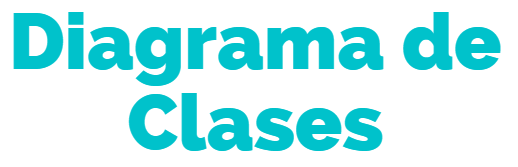

# Proyecto ETS 1ero DAW

  

 
↑ Aquí encontrarás toda la descripción del funcionamiento de la aplicación ↑

↑ Esquema de representación de las funciones principales de la aplicación con las que pueden interactuar los usuarios.↑

↑ Representación del comportamiento interno de la aplicación ↑
  

↑ Información sobre como usar la aplicación ↑

