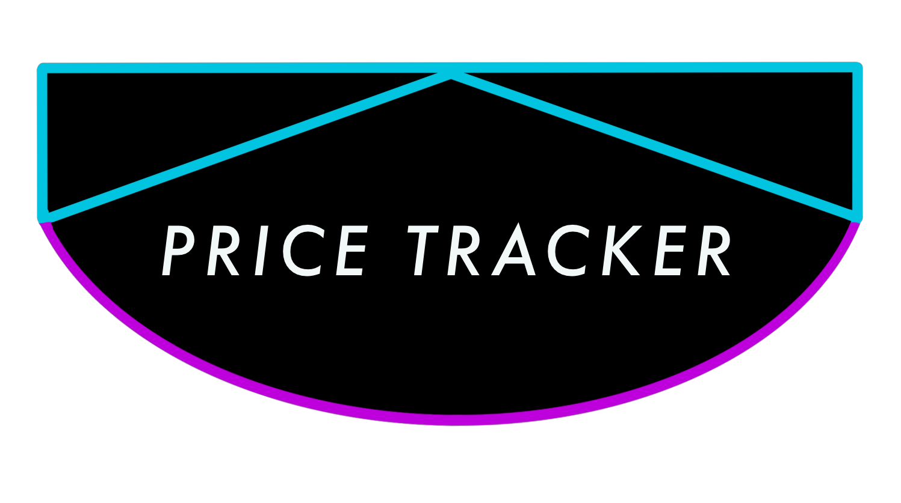

# Proyecto ETS 1ero DAW

Nuestro proyecto se va a basar en una aplicación que cumple con el objetivo de prestar un tipo de información al usuario donde le muestra un análisis de los productos más baratos de supermercados o puntos de venta dentro de un ratio de 50km, además contará con ofertas diarias de ciertos productos que solo serán canjeables desde la aplicación.

## Uso principal

La aplicación basa su funcionamiento en la búsqueda y comparación del precio de los productos que el usuario desee, listándole los más asequibles.

Esta cuenta con una base de datos de varios supermercados y puntos de ventas de productos de primera necesidad, asegurándose que el usuario tenga acceso a los productos más económicos de cada centro de venta.

Los usuarios premium contarán con un sistema de puntos, donde serán ofrecidos desde la aplicación a ser canjeados en el supermercado o puntos de venta, de esta forma se podrá acreditar que el usuario ha comprado dicho producto. 

Tras cada código QR canjeado se acumularán estos puntos, que posteriormente podrán ser usados para conseguir un mayor porcentaje de descuento en las ofertas del día.

## Público Objetivo

La aplicación va dirigida a todas las personas que deseen adquirir productos de primera necesidad, lo que engloba a todo tipo de público.

## Requisitos principales de la aplicación

- Principalmente estar conectado a una red.
- Tener una cuenta creada dentro de la aplicación.
- Tener activada la geolocalización.

## Precio de la apliación

La aplicación será totalmente gratuita para hacer búsquedas de los productos más asequibles del mercado.

Se tendrá que unir a la membresía de usuarios si se quiere acceder al sistema de puntos y ofertas.

El precio para acceder a las funciones de un usuario premium tendrá un coste de 4,99€/mes. Contaremos planes anuales que tomará un precio de 51,99€/año.

